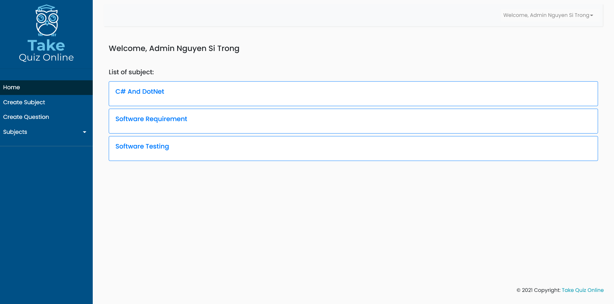

<h1 align="center">:white_check_mark: Take Quiz Online :white_check_mark:</h1>

## :pencil2: Description 
- A java web app that allows students to take a quiz made by teachers.

  

## :computer: Technicals
- Java Web Application
- Java Servlet and JSP service
- Apache Tomcat 8.0.27.0
- Netbean IDE 8.2 RC
- SQL Server

---

# Demo

## **Login page**

  

## **Admin page**

  

## **Student page**

  

***

✨ *Thank you for visiting* ✨
